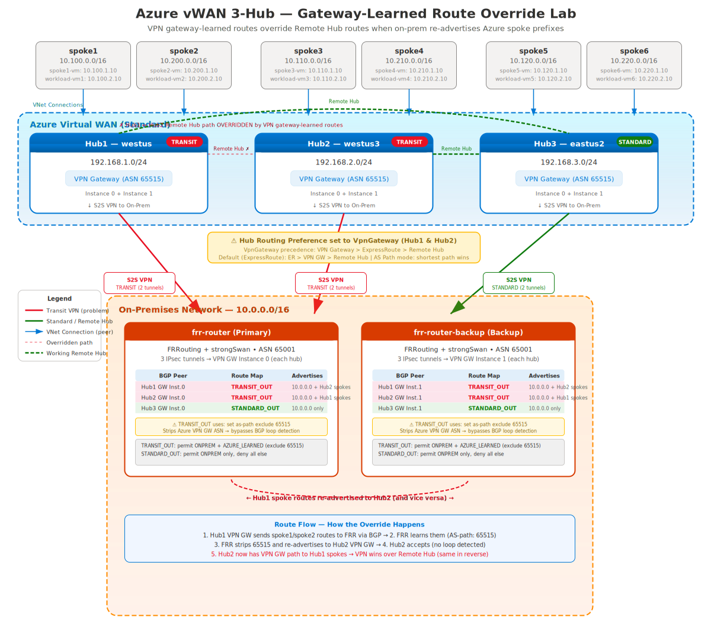

# Azure vWAN 3-Hub Gateway-Learned Route Override Lab

## TL;DR

If on-premises BGP re-advertises Azure prefixes learned from one vWAN hub back to another hub via a VPN connection, the receiving hub treats the route as VPN gateway-learned. Because Virtual WAN prefers gateway-learned routes over inter-hub (Remote Hub) routes, the inter-hub backbone path is overridden. This lab demonstrates the behavior using a three-hub vWAN topology and simulated on-prem BGP routing.

---

> **Lab Purpose**: Reproduce the scenario where **VPN gateway-learned routes override inter-hub (Remote Hub) routes** in Azure Virtual WAN, caused by an on-premises device re-advertising Azure spoke prefixes back through VPN S2S connections.

This lab uses **two on-prem FRRouting/strongSwan VMs** with **six total IPsec tunnels** (two per hub) acting as **transit routers** that re-advertise Azure-learned routes between Hub1 and Hub3, but not Hub2. This causes Hub1 and Hub3 to prefer the VPN Gateway path over the normal Remote Hub path for each other's spoke prefixes.

## Architecture Overview



### FRR Transit Behavior

| Hub | FRR Peer Role | BGP Outbound Policy |
|-----|---------------|---------------------|
| Hub1 (westus3) | **TRANSIT** | On-prem `10.0.0.0/16` + re-advertised Azure routes from Hub3 |
| Hub2 (eastus2) | **STANDARD** | On-prem `10.0.0.0/16` only (no transit re-advertisement) |
| Hub3 (westus) | **TRANSIT** | On-prem `10.0.0.0/16` + re-advertised Azure routes from Hub1 |

### IP Address Summary

| Component | Hub1 (westus3) | Hub2 (eastus2) | Hub3 (westus) |
|-----------|---------------|----------------|---------------|
| Hub address prefix | `192.168.1.0/24` | `192.168.2.0/24` | `192.168.3.0/24` |
| Spoke VNets | spoke1 (`10.100.0.0/16`), spoke2 (`10.200.0.0/16`) | spoke3 (`10.110.0.0/16`), spoke4 (`10.210.0.0/16`) | spoke5 (`10.120.0.0/16`), spoke6 (`10.220.0.0/16`) |
| Primary tunnel | `frr-router` → GW Instance 0 | `frr-router` → GW Instance 0 | `frr-router` → GW Instance 0 |
| Backup tunnel | `frr-router-backup` → GW Instance 1 | `frr-router-backup` → GW Instance 1 | `frr-router-backup` → GW Instance 1 |
| Workload VMs | `spoke1-vm` (`10.100.1.10`), `spoke2-vm` (`10.200.1.10`) | `spoke3-vm` (`10.110.1.10`), `spoke4-vm` (`10.210.1.10`) | `spoke5-vm` (`10.120.1.10`), `spoke6-vm` (`10.220.1.10`) |

Both FRR VMs sit in the shared **on-prem VNet** (`10.0.0.0/16`).

## Real-World Causes

This lab uses FRR route maps with `as-path exclude 65515` to deliberately reproduce the problem, but in real customer environments it typically happens through less obvious paths:

1. **No outbound route filtering** — The most common case. The on-prem router has no export policy and re-advertises everything it learns from one BGP peer to all others. If it connects to multiple hubs, Azure routes leak between them.
2. **SD-WAN overlays** — SD-WAN appliances (Cisco Viptela, Palo Alto Prisma, etc.) learn routes from one tunnel and propagate them across the overlay fabric. They often don't preserve AS-path, which bypasses loop detection automatically.
3. **Route redistribution** — Customer redistributes BGP into OSPF (or another IGP) internally, then redistributes back into BGP toward a different hub. The AS-path gets lost in the IGP hop.
4. **iBGP between on-prem routers** — Two on-prem routers peered via iBGP, each connecting to a different hub. Routes learned from one hub propagate via iBGP to the second router, which advertises them to another hub.
5. **Static route redistribution** — Static routes for Azure prefixes (e.g., as backup) get redistributed into BGP toward another hub.

> **Why `as-path exclude` is needed in this lab:** Because the lab uses a single FRR router talking to all three hubs with eBGP, the Azure VPN GW would normally see its own ASN `65515` in the path and drop the route (loop detection). The `as-path exclude 65515` simulates what happens naturally in scenarios 2–5, where the AS-path is stripped or lost as a side effect of the customer's network design.

## Problem Statement

When an on-premises device (or virtual appliance) re-advertises Azure spoke prefixes learned via BGP back through VPN S2S connections to other hubs, the VPN gateway-learned routes **override the inter-hub (Remote Hub) routes**.

### What Happens

1. Hub1 advertises its spoke prefixes (`10.100.0.0/16`, `10.200.0.0/16`) to the FRR VM via BGP
2. The FRR VM learns these routes and **re-advertises them to Hub3** (transit behavior)
3. Hub3 now has **two paths** to Hub1's spokes:
   - **Remote Hub** path (hub-to-hub via vWAN backbone) — NextHopType: `Remote Hub`
   - **VPN Gateway** path (via on-prem FRR transit) — NextHopType: `VPN_S2S_Gateway`
4. **The VPN Gateway path wins** because gateway-learned routes take precedence

The same happens in reverse: Hub1 sees Hub3's spoke routes via VPN Gateway instead of Remote Hub.

### Expected vs Actual Routing

| Destination | Hub1 Expected | Hub1 Actual | Hub2 Expected | Hub2 Actual |Hub3 Expected | Hub3 Actual |
|---|---|---|---|---|---|---|
| `10.120.0.0/16` (spoke5) | RemoteHub | **VPN GW** | RemoteHub | RemoteHub | Direct | Direct |
| `10.220.0.0/16` (spoke6) | RemoteHub | **VPN GW** | RemoteHub | RemoteHub | Direct | Direct |
| `10.100.0.0/16` (spoke1) | Direct | Direct | RemoteHub | RemoteHub | RemoteHub | **VPN GW** |
| `10.200.0.0/16` (spoke2) | Direct | Direct | RemoteHub | RemoteHub | RemoteHub | **VPN GW** |

Hub2 is unaffected because the FRR VMs only apply `STANDARD_OUT` route-map to Hub2 peers (on-prem prefix only, no transit re-advertisement). Hub2 behaves normally because the FRR routers do not re-advertise Azure prefixes toward that hub, so it only learns spoke routes via the vWAN backbone (Remote Hub).

### Portal Evidence — Hub Effective Routes

**Hub1 (TRANSIT)** — spoke5/spoke6 routes learned via VPN Gateway instead of Remote Hub:


**Hub2 (STANDARD)** — spoke5/spoke6 routes correctly learned via Remote Hub:


**Hub3 (TRANSIT)** — spoke1/spoke2 routes learned via VPN Gateway instead of Remote Hub:


## Root Cause

The issue occurs when on-premises BGP advertises Azure prefixes learned from one Virtual WAN hub back into Azure via a VPN connection to another hub. The receiving hub sees the prefix as a **VPN gateway-learned route** rather than a **Remote Hub route**.

Because Virtual WAN prefers gateway-learned routes over inter-hub (Remote Hub) routes, the VPN gateway route is selected as the best path — even though the vWAN backbone provides a more direct route.

This behavior is expected in Virtual WAN when a prefix is learned from multiple sources and one path is learned through a gateway. It is not a defect — it is a consequence of route selection design.

### Route Flow


## Mitigation Options

Prevent Azure-learned routes from being re-advertised back into Azure. Common approaches include:

- **BGP outbound filtering** on the on-premises router — deny Azure VNet prefixes in export policy
- **AS-path filtering** — reject routes containing ASN 65515 from being re-advertised
- **Prefix lists** — explicitly block Azure spoke prefixes (e.g., `10.100.0.0/16`, `10.200.0.0/16`) from outbound advertisements to other hubs
- **Route-maps** — apply deny rules for Azure-learned prefixes on specific BGP neighbors
- **Hub routing preference** — set to AS Path mode so shorter Remote Hub paths are preferred over longer VPN-transited paths

The recommended fix is filtering at the source (on-prem router) to ensure hubs use the intended Remote Hub route over the vWAN backbone.

## Why Two VMs?

Using separate VMs avoids Linux XFRM (IPsec policy) conflicts when multiple tunnels have overlapping traffic selectors on the same host. Each VM has:
- Its own public IP
- **Three IPsec tunnels** (one to each hub's VPN Gateway instance)
- **Three BGP sessions** with distinct outbound policies per hub

## Prerequisites

- **PowerShell 7+** — Install from https://aka.ms/PSWindows (run with `pwsh`)
- **Azure CLI** — Logged in with `az login`
- **Azure Subscription** with Contributor/Owner access
- Sufficient quota for: 3× VPN Gateway (vWAN), 9× VMs, Public IPs

## Deployment

```powershell
# Clone the repository
git clone https://github.com/colinweiner111/azure-vwan-3hub-lab.git
cd azure-vwan-3hub-lab

# Deploy the lab (~30-45 minutes — 3 VPN Gateways deploy in parallel)
.\deploy-bicep.ps1 -ResourceGroupName vwan-3hub-lab -Location westus3 -VpnPsk "YourPreSharedKey123!"

# Optional: Deploy with Azure Bastion for VM access (adds ~5 min)
.\deploy-bicep.ps1 -ResourceGroupName vwan-3hub-lab -Location westus3 -VpnPsk "YourPreSharedKey123!" -EnableBastion

# Optional: Deploy with Azure Firewall on all hubs (adds ~15 min)
.\deploy-bicep.ps1 -ResourceGroupName vwan-3hub-lab -Location westus3 -VpnPsk "YourPreSharedKey123!" -EnableFirewall
```

### Default Credentials

| Setting | Value |
|---------|-------|
| VM Username | `azureuser` |
| VM Password | (prompted during deployment or via `-AdminPassword`) |
| VPN PSK | (provided via `-VpnPsk` parameter) |

## Lab Testing Scenarios

### Scenario 1: Verify All Tunnels and BGP Sessions

1. SSH to both FRR routers (IPs shown in deployment output)
2. Verify IPsec tunnels (expect 3 SAs — one tunnel to each hub's VPN gateway):
   ```bash
   sudo ipsec status
   # Look for 3 ESTABLISHED tunnels: hub1-tunnel, hub2-tunnel, hub3-tunnel
   ```
3. Verify BGP sessions are established with all three hub VPN gateways:
   ```bash
   sudo vtysh -c "show ip bgp summary"
   # Expect 3 peers in Established state — the BGP peer IPs are the VPN gateway
   # instance IPs inside each hub (found in Azure Portal → VPN Gateway → BGP Settings)
   ```
4. Verify transit routes being advertised to Hub1 and Hub3:
   ```bash
   # Check what frr-router advertises to Hub1's BGP peer
   sudo vtysh -c "show ip bgp neighbors <hub1-bgp-ip> advertised-routes"
   # Should show: 10.0.0.0/16 + Hub3 spoke prefixes (10.120.0.0/16, 10.220.0.0/16)

   # Check what frr-router advertises to Hub2's BGP peer
   sudo vtysh -c "show ip bgp neighbors <hub2-bgp-ip> advertised-routes"
   # Should show: 10.0.0.0/16 ONLY (no transit routes)
   ```

### Scenario 2: Observe Gateway-Learned Route Override

1. Check vWAN effective routes in Azure Portal:
   - Navigate to **Virtual WAN** → **hub1** → **Routing** → **Effective Routes**
2. Look for Hub3's spoke prefixes (`10.120.0.0/16`, `10.220.0.0/16`):
   - **Expected**: NextHopType = `VPN_S2S_Gateway` (overridden by transit)
   - **Without transit, would be**: NextHopType = `Remote Hub`
3. Check Hub2's effective routes:
   - **Expected**: All remote spoke prefixes show NextHopType = `Remote Hub` (normal behavior)
4. Check Hub3's effective routes:
   - **Expected**: Hub1's spoke prefixes (`10.100.0.0/16`, `10.200.0.0/16`) via `VPN_S2S_Gateway`

### Scenario 3: Compare Hub2 (Normal) vs Hub1/Hub3 (Overridden)

```powershell
$rg = "vwan-3hub-lab"

# Hub1 effective routes — should show Hub3 spokes via VPN Gateway
az network vhub get-effective-routes -g $rg -n hub1-westus3 `
  --resource-type HubVirtualNetworkConnection `
  --resource-id (az network vhub connection show -g $rg --vhub-name hub1-westus3 -n conn-spoke1 --query id -o tsv) | ConvertFrom-Json | Select-Object -ExpandProperty value | Format-Table

# Hub2 effective routes — should show all remote spokes via Remote Hub
az network vhub get-effective-routes -g $rg -n hub2-eastus2 `
  --resource-type HubVirtualNetworkConnection `
  --resource-id (az network vhub connection show -g $rg --vhub-name hub2-eastus2 -n conn-spoke3 --query id -o tsv) | ConvertFrom-Json | Select-Object -ExpandProperty value | Format-Table

# Hub3 effective routes — should show Hub1 spokes via VPN Gateway
az network vhub get-effective-routes -g $rg -n hub3-westus `
  --resource-type HubVirtualNetworkConnection `
  --resource-id (az network vhub connection show -g $rg --vhub-name hub3-westus -n conn-spoke5 --query id -o tsv) | ConvertFrom-Json | Select-Object -ExpandProperty value | Format-Table
```

### Scenario 4: Disable Transit to Restore Normal Routing

1. SSH to `frr-router` and remove the TRANSIT route-maps:
   ```bash
   sudo vtysh
   configure terminal
   router bgp 65001
    address-family ipv4 unicast
     # Change Hub1 and Hub3 to STANDARD_OUT (on-prem only)
     neighbor <hub1-bgp-ip> route-map STANDARD_OUT out
     neighbor <hub3-bgp-ip> route-map STANDARD_OUT out
    exit-address-family
   exit
   exit
   # Clear BGP to send updated advertisements
   clear ip bgp * soft out
   ```
2. Repeat on `frr-router-backup`
3. Wait 1-2 minutes for BGP to reconverge
4. Check Hub1 and Hub3 effective routes
5. **Expected**: Hub1 and Hub3 now show remote spokes via `Remote Hub` (normal)

## FRR Router Commands

```bash
# BGP summary (3 peers per VM)
sudo vtysh -c "show ip bgp summary"

# Full BGP table
sudo vtysh -c "show ip bgp"

# Routes advertised to a specific peer
sudo vtysh -c "show ip bgp neighbors <bgp-peer-ip> advertised-routes"

# Routes received from a specific peer
sudo vtysh -c "show ip bgp neighbors <bgp-peer-ip> received-routes"

# IPsec tunnel status (expect 3 SAs)
sudo ipsec status

# View FRR running configuration
sudo vtysh -c "show running-config"

# View route-maps
sudo vtysh -c "show route-map"
```

## Key Azure Concepts Demonstrated

1. **Gateway-learned route precedence** — VPN gateway routes override Remote Hub routes for the same prefix
2. **Hub-to-hub routing** — Normal behavior when transit re-advertisement is not occurring
3. **Per-hub BGP behavior** — Selective transit can cause asymmetric routing across hubs
4. **Multi-hub vWAN** — Hub-to-hub routing across three regions
5. **FRR route-maps** — Controlling which routes are re-advertised per BGP neighbor

## Cleanup

```powershell
az group delete -n vwan-3hub-lab --yes --no-wait
```

## Related

- [azure-vwan-vpn-failover](https://github.com/colinweiner111/azure-vwan-vpn-failover) — ER/VPN failover lab with LPM and Route Maps

## References

- [Virtual WAN Hub Routing](https://learn.microsoft.com/azure/virtual-wan/about-virtual-hub-routing)
- [Virtual WAN Hub Routing Preference](https://learn.microsoft.com/azure/virtual-wan/about-virtual-hub-routing-preference)
- [Virtual WAN Site-to-Site VPN](https://learn.microsoft.com/azure/virtual-wan/virtual-wan-site-to-site-portal)
- [FRRouting Documentation](https://docs.frrouting.org/)
- [strongSwan Documentation](https://docs.strongswan.org/)

MIT Licensed
